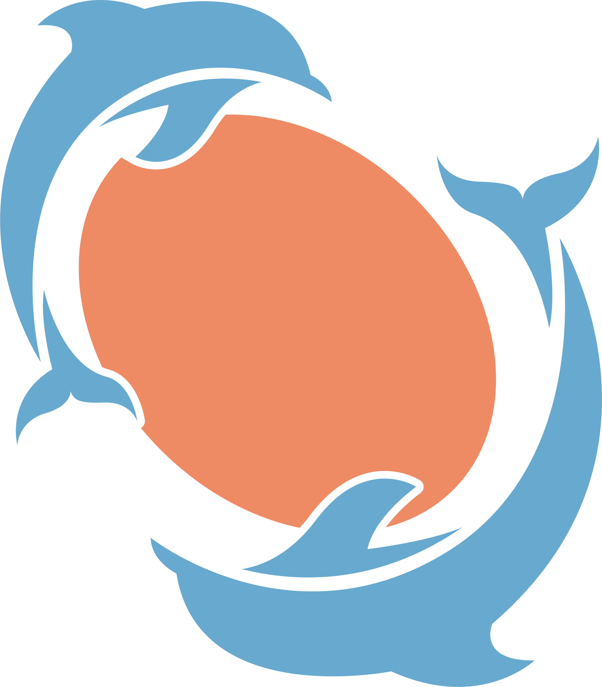

=================
|logo| dolphin
=================

|tests| |docs| |coverage| |black| |docformatter| |docstyle|

.. |tests| image:: https://travis-ci.com/ajshajib/dolphin.svg?branch=master
    :target: https://travis-ci.com/ajshajib/dolphin
    :alt: build

.. |docs| image:: https://readthedocs.org/projects/dolphin-docs/badge/?version=latest
    :target: https://dolphin-docs.readthedocs.io/en/latest/?badge=latest
    :alt: docs

.. |coverage| image:: https://codecov.io/gh/ajshajib/dolphin/graph/badge.svg?token=WZVXZS9GF1 
    :target: https://codecov.io/gh/ajshajib/dolphin
    :alt: codecov

.. |black| image:: https://img.shields.io/badge/code%20style-black-000000.svg
    :target: https://github.com/psf/black
    :alt: black

.. |docformatter| image:: https://img.shields.io/badge/%20formatter-docformatter-fedcba.svg
    :target: https://github.com/PyCQA/docformatter
    :alt: docformatter

.. |docstyle| image:: https://img.shields.io/badge/%20style-sphinx-0a507a.svg
    :target: https://www.sphinx-doc.org/en/master/usage/index.html
    :alt: sphinx

Semi-automated pipeline for lens modeling based on `lenstronomy`_.

.. _lenstronomy: https://github.com/sibirrer/lenstronomy

***************
Features
***************

* Semi-automated modeling of a large sample of quasar and galaxy-galaxy lenses.
* Joint multi-band lens modeling.
* Easy portability between local and HPCC environments.
* Initial fitting recipe for galaxy-galaxy lenses for faster convergence.

***************
Citation
***************

If you use `dolphin` in your research, please cite `Shajib et al. (2021)
<https://ui.adsabs.harvard.edu/abs/2021MNRAS.503.2380S/abstract>`_ and `Tan et al. (2024) <https://ui.adsabs.harvard.edu/abs/2023arXiv231109307T/abstract>`_.
